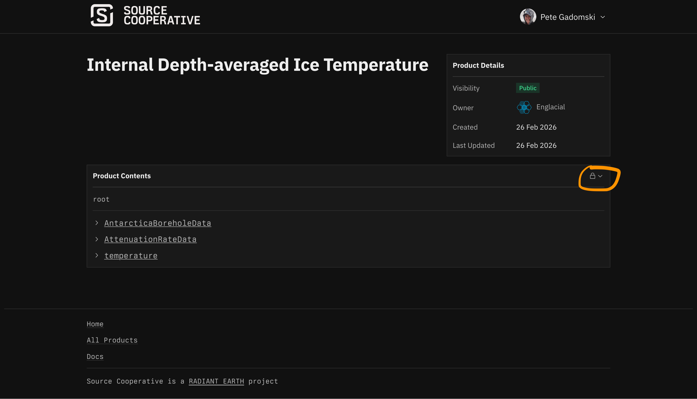
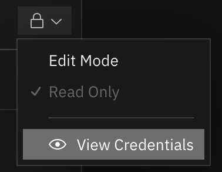

# Living Ice Sheet Temperature


Visualize, download, and process Antarctic ice sheet temperature data.
Resources:

- [Map-based frontend](https://elizadawson.github.io/living-ice-sheet-temperature/)
- [Source data on source.coop](https://source.coop/englacial/ice-sheet-temperature)
- [Python package documentation](https://elizadawson.github.io/living-ice-sheet-temperature/docs/)

## Processing data

You'll need [GDAL with Parquet support](https://gdal.org/en/stable/drivers/vector/parquet.html#conda-forge-package) and [tippecanoe](https://github.com/felt/tippecanoe?tab=readme-ov-file#installation).
To generate everything:

```sh
scripts/generate
```

### Custom GDAL

If you need to specify which GDAL you'd like to use to enable parquet support:

```sh
GDAL=/a/path/to/gdal scripts/generate
```

## Uploading data

To upload, you first need the [AWS CLI](https://aws.amazon.com/cli/) and credentials from source.coop.
Go to https://source.coop/englacial/ice-sheet-temperature and click on the lock:



This will give you the option to "View credentials":



Choose "Environment Variables" and then copy those `export` commands into your shell.
Then:

```sh
scripts/upload
```

## Developing

First, clone the repository:

```sh
git clone https://github.com/elizadawson/living-ice-sheet-temperature
cd living-ice-sheet-temperature
```

To run the frontend locally, get [yarn](https://yarnpkg.com/getting-started/install), then:

```sh
cd frontend
yarn install
yarn dev
```

This will open the frontend at http://localhost:5174/living-ice-sheet-temperature/.

For backend processing, we have some light tests:

```sh
uv run pytest
```

To run all of our checks (linting, formatting, etc):

```sh
scripts/check
```
