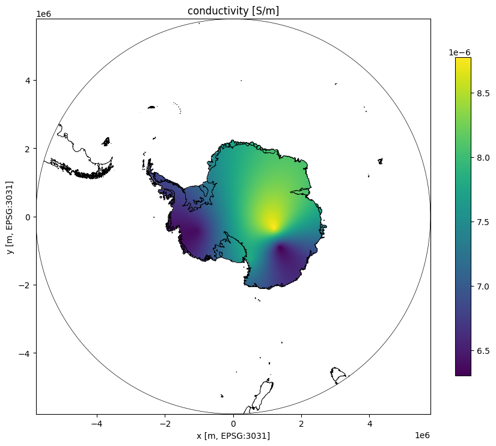

# Conductivity kriging over Antarctica

Build an ordinary kriging surface for borehole conductivity and plot it over a continent outline in EPSG:3031.


```python
import geopandas
import matplotlib.pyplot as plt
import numpy
import shapely.vectorized

from livist.client import Client
```


```python
client = Client()
kriging = client.get_conductivity_and_temperature_kriging()
```

Load the Antarctic basemap (already in EPSG:3031) so we can both bound the kriging grid and overlay the continent outline.


```python
basemap = geopandas.read_file("../frontend/public/quantartica-simple-basemap.json")
basemap = basemap.set_crs("EPSG:3031", allow_override=True)
xmin, ymin, xmax, ymax = basemap.total_bounds
xmin, ymin, xmax, ymax
```


    (np.float64(-5791903.876384497),
     np.float64(-5791903.876384497),
     np.float64(5791903.876384493),
     np.float64(5791903.876384493))


```python
resolution = 25_000  # 25 km grid cells
gridx = numpy.arange(xmin, xmax + resolution, resolution)
gridy = numpy.arange(ymin, ymax + resolution, resolution)

conductivity_grid, _ = kriging.conductivity.execute("grid", gridx, gridy)

ice_sheet_categories = {"Land", "Ice shelf", "Ice tongue", "Rumple"}
ice_sheet = basemap[basemap["Category"].isin(ice_sheet_categories)].union_all()

mesh_x, mesh_y = numpy.meshgrid(gridx, gridy)
inside = shapely.vectorized.contains(ice_sheet, mesh_x, mesh_y)

conductivity_grid = numpy.ma.masked_where(~inside, conductivity_grid)
conductivity_grid.shape
```

    /var/folders/yp/d6xvrkd943dgvqg5s9cpymc40000gn/T/ipykernel_452/3607599808.py:11: DeprecationWarning: The 'shapely.vectorized.contains' function is deprecated and will be removed a future version. Use 'shapely.contains_xy' instead (available since shapely 2.0.0).
      inside = shapely.vectorized.contains(ice_sheet, mesh_x, mesh_y)


    (465, 465)


```python
fig, ax = plt.subplots(figsize=(9, 8))
extent = (gridx[0], gridx[-1], gridy[0], gridy[-1])

image = ax.imshow(conductivity_grid, extent=extent, origin="lower", cmap="viridis")
basemap.boundary.plot(ax=ax, color="black", linewidth=0.5)
ax.set_title("conductivity [S/m]")
ax.set_xlabel("x [m, EPSG:3031]")
ax.set_ylabel("y [m, EPSG:3031]")
ax.set_xlim(xmin, xmax)
ax.set_ylim(ymin, ymax)
ax.set_aspect("equal")
fig.colorbar(image, ax=ax, shrink=0.7)

plt.tight_layout()
plt.show()
```


    

    

