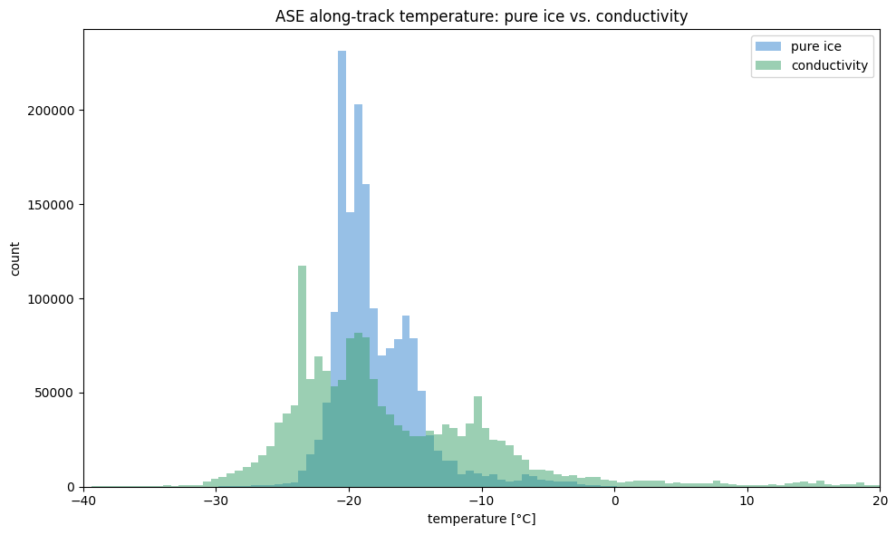

# Temperature comparison: pure ice vs. conductivity

Compare the along-track temperature distributions for the ASE attenuation dataset under the two computation modes. The two parquet files are produced by `livist temperature` (pure ice) and `livist temperature --mode conductivity`.


```python
import matplotlib.pyplot as plt
import pandas
```


```python
pure_ice = pandas.read_parquet("../data/temperature-ase-pure-ice.parquet")["temperature"]
conductivity = pandas.read_parquet("../data/temperature-ase-conductivity.parquet")["temperature"]
pure_ice.describe(), conductivity.describe()
```


    (count    1.624351e+06
     mean     2.551333e+02
     std      3.333328e+00
     min      2.036604e+02
     25%      2.528742e+02
     50%      2.542445e+02
     75%      2.568683e+02
     max      2.753755e+02
     Name: temperature, dtype: float64,
     count    1.624351e+06
     mean     2.565409e+02
     std      8.749606e+00
     min      1.568602e+02
     25%      2.506707e+02
     50%      2.543089e+02
     75%      2.608719e+02
     max      3.145590e+02
     Name: temperature, dtype: float64)


```python
fig, ax = plt.subplots(figsize=(10, 6))
bins = 100
hist_range = (-40, 20)
ax.hist(pure_ice - 273.15, bins=bins, range=hist_range, alpha=0.5, label="pure ice", color="#3182ce")
ax.hist(conductivity - 273.15, bins=bins, range=hist_range, alpha=0.5, label="conductivity", color="#38a169")
ax.set_xlim(*hist_range)
ax.set_xlabel("temperature [°C]")
ax.set_ylabel("count")
ax.set_title("ASE along-track temperature: pure ice vs. conductivity")
ax.legend()
plt.tight_layout()
plt.show()
```


    

    

